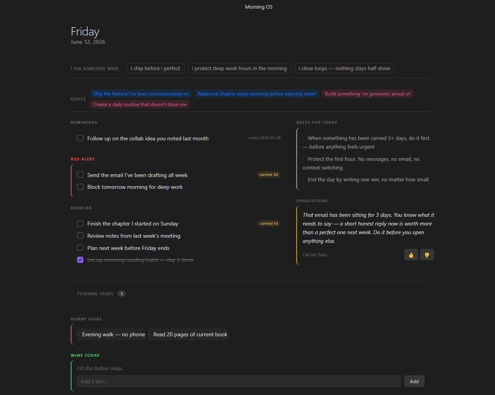
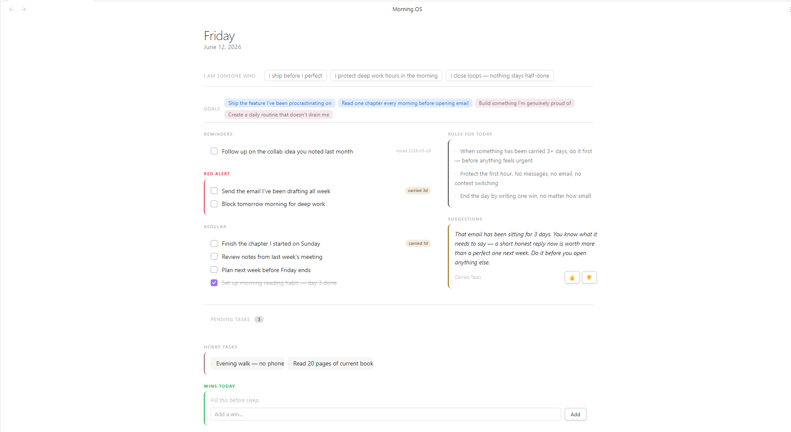
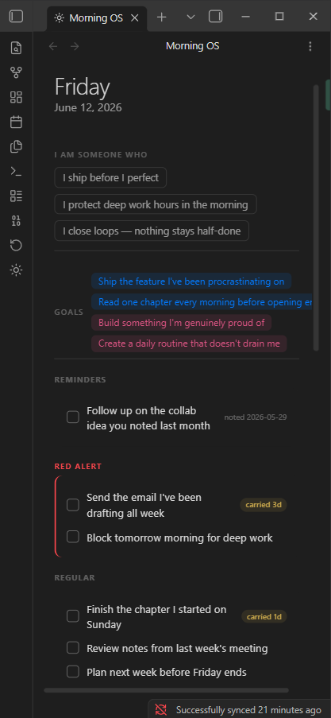

# Morning OS

[](https://community.obsidian.md/plugins/morning-os)
[](https://community.obsidian.md/plugins/morning-os)

> Your Obsidian vault, processed every morning. Morning OS reads your goals, tasks, and rules — and generates a personalized briefing dashboard. Spend your morning focused, not reorganizing.

[](images/dashboard-dark.png)

---

## The problem

Your vault is full of goals, tasks, and rules you wrote for yourself. But every morning you still open Obsidian and spend ten minutes figuring out where to start — rereading the same files, rediscovering the same priorities.

Morning OS does that reading for you. Open the panel, your day is already laid out.

---

## What you get

[](images/dashboard-light.png)

| Section | What it does |
|---|---|
| **Identity strip** | Your own rules about who you're trying to be — before you see a single task |
| **Goals bar** | Top short and long-term goals, so the daily grind stays connected to the bigger picture |
| **Red alert tasks** | Urgent tasks from today's note, with a badge showing how many days each has been carried |
| **Regular tasks** | Normal persistent Today tasks — they remain selected until you act on them |
| **Rules for today** | The AI picks the rules from your rules file most relevant to today's tasks |
| **Suggestions** | A short nudge based on your patterns and what's been sitting undone |
| **Wins** | A prompt at the end of the day — what you write here goes straight into your daily note |

The AI picks which of your items to surface. It never rewrites or edits your vault. The only new text it generates is the suggestion.

---

## Works on mobile

No terminal, no Python, no desktop-only dependencies. The plugin runs entirely inside Obsidian — tap the sun icon on your phone and your brief is ready.

The only requirement is that your vault syncs across devices.

> **Recommended:** [Remotely Save](https://github.com/remotely-save/remotely-save) with Dropbox. Make sure your sync settings include folders starting with `_` — that's where Morning OS writes its briefs.

### Home Screen widget notes and sync

Morning OS can export Identity, goals, Today, Inbox, or All tasks to an owned Markdown note for Obsidian's iPhone/iPad Home Screen **View Note** widget. Add and enable an export in **Settings → Morning OS → Widget notes**, then point the widget at that note. These notes are display-only; changing their Markdown or checkboxes does not change a task. See [widget setup](docs/widgets.md) for test-vault installation, iOS requirements, and limitations.

Remotely Save transfers vault files through the remote and include/exclude rules you configure. It can transfer `_generated/data/state.json` (the authoritative tasks, notes, Today membership, date reminders, and occurrence acknowledgements), briefing JSON, configured source notes, and widget Markdown notes, but only when your configuration includes those paths. It does not deliver calendar events or run Morning OS while Obsidian is closed.

| Vault data | Purpose and sync consideration |
|---|---|
| `_generated/data/state.json` | Authoritative item state. Sync it if tasks must move between devices. |
| `_generated/briefs/`, configured identity/goals/wins notes, and widget destinations | Source and display content. Widget notes are regenerated representations, not task authority. |
| `_generated/snapshots/`, `_generated/recovery/`, feedback, legacy files, pending transaction artifacts | Recovery, feedback, or compatibility data. Whether they sync depends on your include/exclude rules; transaction artifacts are neither locks nor device-local storage. |
| `.obsidian/plugins/morning-os/` | Morning OS settings live here. Transfer depends on whether your sync service includes hidden/plugin configuration folders. |

Check your provider's configured include/exclude rules and hidden-file options rather than assuming every eligible path syncs. Calendar publishing is not available yet: a safe mobile adapter needs provider-enforced idempotency and stale-device conflict handling before it can be enabled.

[](images/mobile.png)

---

## Setup

1. Install from **Settings → Community Plugins → Browse** and search "Morning OS"
2. Enable the plugin
3. Open **Settings → Morning OS** — pick an AI provider and enter your API key
4. Click the sun icon in the sidebar — Morning OS walks you through the rest

**Supported AI providers:** OpenAI · Google Gemini · Groq · AWS Bedrock

> **No API key?** Morning OS still works — it uses your vault data directly without AI curation. Add a key later when you're ready.

---

## FAQ

**Does it read my private notes?**
Only the files you point it to in settings — daily notes, rules, goals, and task files. It never reads your entire vault. All paths are configurable.

**Does my data leave my device?**
Only if you add an AI provider API key. Without one, everything stays local. With one, only the structured content from your configured files is sent — not your full vault.

**Does it work without an API key?**
Yes. Without a key, it renders your tasks, goals, and rules directly from your vault with no AI curation. You can add a key later.

**Does it work on mobile?**
Yes — iOS and Android, with no extra setup beyond vault sync.

**What if my daily note doesn't exist yet?**
Morning OS keeps unfinished Today selections until you complete, dismiss, delete, or explicitly remove them.

**How do I give feedback or report a bug?**
Use the feedback button inside the plugin dashboard — it takes 30 seconds and goes directly to the developer.

---

## Vault structure

The plugin reads files you already maintain. All paths are configurable in settings.

```
Essential/
  Daily/YYYY-MM-DD.md              ← daily note
  State of Mind/
    Tactical Rules.md
    Emotional Rules.md
    Long-term and Short-term.md
  Pending Tasks/
    Technical Tasks.md
_generated/                        ← plugin writes here
  briefs/
  feedback/
```

Daily note format:

```markdown
## Red alert
- [ ] urgent task

## Regular
- [ ] normal task

## Wins
- something good
```

Heading names are fully configurable.

---

<details>
<summary><strong>How it works under the hood</strong></summary>

1. Reads today's daily note and your source files
2. Fuzzy-matches incomplete tasks against previous briefs to detect carries (looks back up to 7 days across skipped days)
3. Single LLM call picks relevant rules and goals, and writes a suggestion
4. Brief saved to `_generated/briefs/YYYY-MM-DD.json`
5. Dashboard renders from the brief

Suggestion reactions (👍/👎) are stored per-day and feed into the next run.

</details>

<details>
<summary><strong>Configuration</strong></summary>

**Settings → Morning OS:**

- **Briefing agent** — one explicit Regenerate briefing action
- **AI provider** — provider, model, credentials
- **Vault paths** — all source and output paths
- **Section headings** — heading names in your daily note and goals file
- **How many items to show** — per-field counts
- **AI vs direct mode** — per-field toggle; "direct" = verbatim from vault, "AI" = LLM picks

</details>

<details>
<summary><strong>Development</strong></summary>

```bash
npm install
npm run dev      # watch + copy to vault on save
npm run build    # production build
npm run deploy   # build + copy to vault
```

Set `OBSIDIAN_PLUGIN_DIR` to your vault's plugin folder path.

</details>

---

Built by [@satyagalla](https://github.com/satyagalla) · For feedback use the button inside the plugin or [open a GitHub issue](https://github.com/satyagalla/Morning-OS-obsidian/issues)
